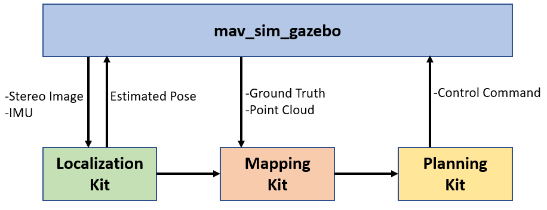

# E2ES
## End-to-End UAV Simulation for Visual SLAM and Navigation
### Introduction


This Kit provides an end to end simulation solution for MAV visual SLAM (or path planning) researches. <br />
In this work, several features are added to the default [PX4](https://github.com/PX4/Firmware) Gazebo Simulator: <br />
-A realsense D435 model (based on [realsense_gazebo_plugin](https://github.com/pal-robotics/realsense_gazebo_plugin)) <br />
-Modified IRIS MAV model <br />
-Several structured/unstructured simulation world <br />
<!-- -Keyborad control support <br /> -->
The work has been verified on Ubuntu 18.04/20.04 + ROS melodic/noetic environment <br />
Also, if you want to save time,
we strongly suggest you to use docker image! 
The link is right [here](https://github.com/HKPolyU-UAV/airo_docker_lib).

### Demo Video

<a href="https://www.youtube.com/watch?v=sKkA5f62P6g" target="_blank"></a>

| manual control    | Click and fly navigation   |
| ---------------------- | ---------------------- |
|   |   |

### Usage
If you still insist not to use docker,
here is the installation instructions:


Install pre-requisites (ubuntu 18.04):
````
sudo apt-get install ros-melodic-mavros ros-melodic-mavros-extras ros-melodic-mavros-msgs libncurses5-dev python3-pip libgstreamer1.0-dev python-jinja2 python-pip python-testresources libignition-math2 libgazebo9-dev
pip3 install --user empy toml numpy packaging jinja2
pip install numpy toml empy packaging
sudo apt upgrade libignition-math2
wget https://raw.githubusercontent.com/mavlink/mavros/master/mavros/scripts/install_geographiclib_datasets.sh
sudo bash ./install_geographiclib_datasets.sh
````
Install pre-requisites (ubuntu 20.04):
````
sudo apt-get install ros-noetic-mavros ros-noetic-mavros-extras ros-noetic-mavros-msgs libncurses5-dev python3-pip libgstreamer1.0-dev python-jinja2 python3-pip python3-testresources libignition-math4 libgazebo11-dev
pip3 install --user empy toml numpy packaging jinja2
pip3 install numpy toml empy packaging
sudo apt upgrade libignition-math4
wget https://raw.githubusercontent.com/mavlink/mavros/master/mavros/scripts/install_geographiclib_datasets.sh
sudo bash ./install_geographiclib_datasets.sh
# neglect all gazebo9-related warning
````

Download and install the PX4 (1.11.0)
````
git clone https://github.com/PX4/PX4-Autopilot.git
cd PX4-Autopilot/
git checkout 71db090
git submodule sync --recursive
git submodule update --init --recursive
bash ./Tools/setup/ubuntu.sh
sudo apt upgrade libignition-math2 #(libignition-math4 for noetic)
make px4_sitl_default gazebo
````

Clone this repository to catkin src folder say: ~/catkin_ws/src
````
cd ~/catkin_ws/src
git clone https://github.com/HKPolyU-UAV/E2ES.git
````
Install 3rd Part Library
````
cd ~/catkin_ws/src/e2es/3rdPartLib
sudo ./install3rdPartLib.sh
sudo ln -s /usr/include/eigen3/Eigen /usr/include/Eigen #if neccessary
````
Compile
````
cd ~/catkin_ws/
catkin_make
````
By default **ROS_WORK_SPACE_PATH** is ~/catkin_ws and **PX4_Firmware_PATH** is ~/PX4-Autopilot <br />
If Not, Edit the path in E2ES/sim.sh script(Line 1 to 4)
````
export GAZEBO_RESOURCE_PATH=$GAZEBO_RESOURCE_PATH:~/catkin_ws/src/e2es/gazebo
export GAZEBO_MODEL_PATH=$GAZEBO_MODEL_PATH:~/catkin_ws/src/e2es/gazebo/models
export GAZEBO_PLUGIN_PATH=$GAZEBO_PLUGIN_PATH:~/catkin_ws/devel/lib
cd ~/PX4-Autopilot
````
to
````
export GAZEBO_RESOURCE_PATH=$GAZEBO_RESOURCE_PATH:ROS_WORK_SPACE_PATH/src/e2es/gazebo
export GAZEBO_MODEL_PATH=$GAZEBO_MODEL_PATH:ROS_WORK_SPACE_PATH/src/e2es/gazebo/models
export GAZEBO_PLUGIN_PATH=$GAZEBO_PLUGIN_PATH:ROS_WORK_SPACE_PATH/devel/lib
cd PX4_Firmware_PATH
````
Run the simulator
````
roscd e2es
./sim.sh
````
Using keyboard to control the MAV in simulator
````
roslaunch e2es keyboard_ctr.launch
````


### Running End-To-End simulation
You can use the FLVIS-glmapping-FUXI(localization-mapping-planning kits) navigation system. <br />
The first step is to install [FLVIS](https://github.com/HKPolyU-UAV/FLVIS), [glmapping](https://github.com/HKPolyU-UAV/glmapping) and [FUXI](https://github.com/chenhanpolyu/fuxi-planner) accordinly. <br />
Then start the simulator localization mapping and planning kit in sequence. <br />
````
roscd e2es
./sim.sh

# flvis
roslaunch flvis e2es.launch # under flvis package

# fuxi
## please refer to fuxi repo
````

### Acknowledgement
This work are based on [PX4 Projcet](https://github.com/PX4/Firmware) and [realsense_gazebo_plugin](https://github.com/pal-robotics/realsense_gazebo_plugin)


### Maintainer
[Patrick Lo](https://github.com/pattylo), AIRo-Lab, RCUAS, PolyU: patty.lo@connect.polyu.hk <br/> 
[Shengyang Chen](https://github.com/Ttoto)(Dept.ME,PolyU): shengyang.chen@connect.polyu.hk <br />

